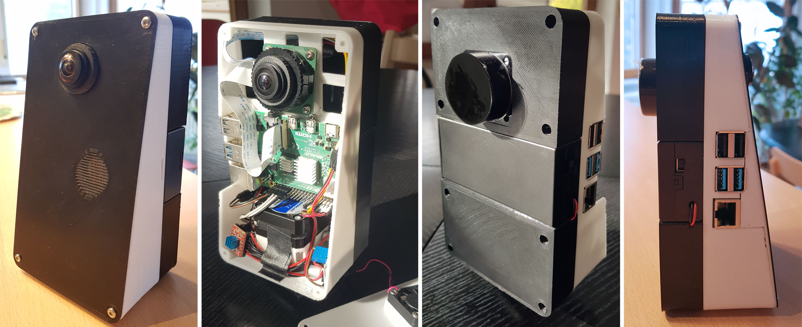
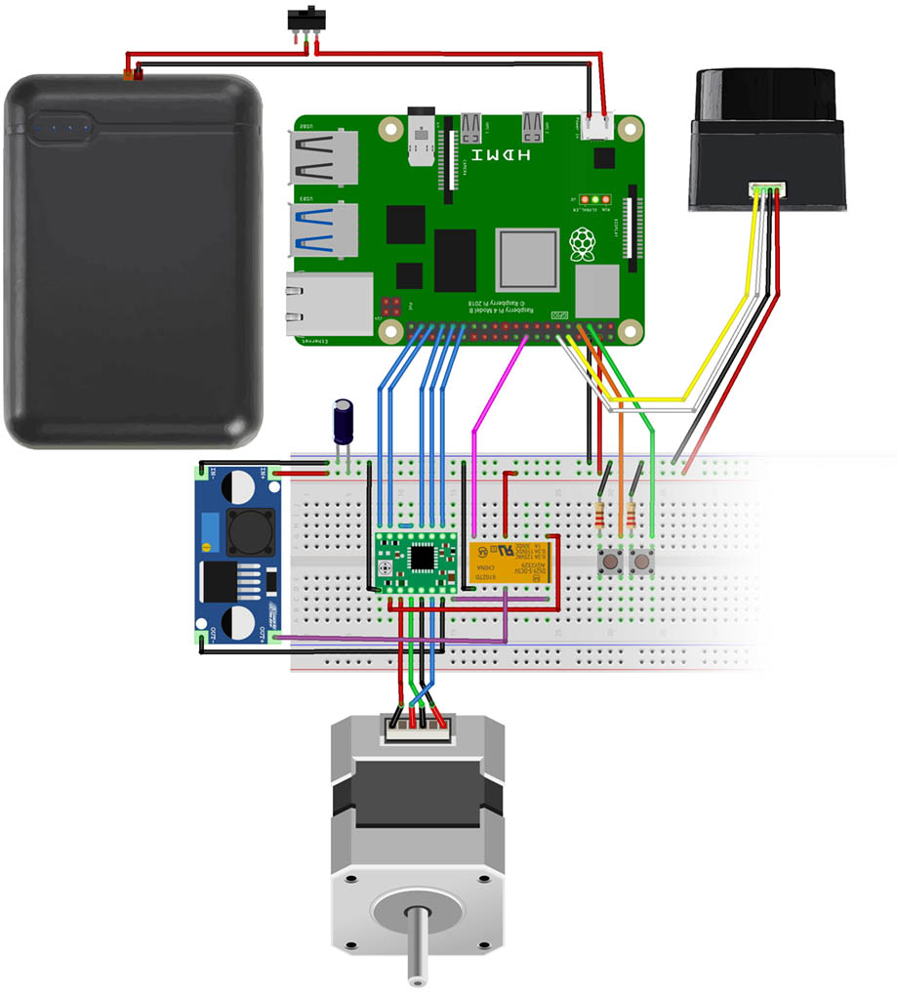

# PiDAR -- WORK IN PROGRESS!

## 360° 3D Panorama Scanner: 
- LDRobot LD06 LiDAR
- HQ Camera with M12 Fisheye Lens Hugin
- Raspberry Pi 4
- Nema17 stepper with A4988 driver

Version 1:

## core features:
- optimized LD06 serial/UART driver
- export 2D data (including luminance) as csv
- cartesian 2D visualisation (matplotlib)
- 3D conversion based on Z-rotation 
- interactive 3D visualisation (Open3D)
- export 3D data as [e57](https://github.com/davidcaron/pye57), pcd or ply
- aligning multiple scans using global registration and ICP fine-tuning
- poisson surface meshing

inspired by:
- [LIDAR_LD06_python_loder](https://github.com/henjin0/LIDAR_LD06_python_loder) and [Lidar_LD06_for_Arduino](https://github.com/henjin0/Lidar_LD06_for_Arduino) by Inoue Minoru ("[henjin0](https://github.com/henjin0)")
- [ShaunPrice's](https://github.com/ShaunPrice/360-camera) StereoPi-supporting fork of [BrianBock's](https://github.com/BrianBock/360-camera) 360-camera script

future reading:
- when moving: [Doppler-ICP](https://github.com/aevainc/Doppler-ICP/blob/main/README.md)

Open3D Demo Data for global registration, ICP, meshing etc.:
- [BunnyMesh.ply](https://github.com/isl-org/open3d_downloads/releases/download/20220201-data/BunnyMesh.ply) from [20220201-data](https://github.com/isl-org/open3d_downloads/releases/tag/20220201-data)
- [DemoICPPointClouds.zip](https://github.com/isl-org/open3d_downloads/releases/download/20220301-data/DemoICPPointClouds.zip) from [20220301-data](https://github.com/isl-org/open3d_downloads/releases/tag/20220301-data)

## wiring

Version 2 - now using 10mAh Powerbank with Step-Up converter and Relay for better power efficiency

LD06 port (left to right)
- UART Tx (yellow), PWM (white), GND (black), VCC 5V (red)

Raspberry Pi:
- LD06 UART0 Rx: GP15 (Pin10)
- LD06 PWM0: GP18 (Pin12)
- LD06 5V: Pin2 or Pin4
- LD06 GND: e.g. Pin6 or Pin14

### Power Button (Wake up & Shut Down)

- Button at GPIO 3
- install [shutdown script](https://github.com/Howchoo/pi-power-button)

### Power LED and CPU fan
    sudo nano /boot/firmware/config.txt

    # CPU fan at lower temp
    dtoverlay=gpio-fan,gpiopin=4,temp=45000

    # Power LED Heartbeat:
    dtparam=pwr_led_trigger=timer

## Serial Protocol
baudrate 230400, data bits 8, no parity, 1 stopbit  
sampling frequency 4500, scan frequency 5-13 Hz, distance 2cm - 12 meter, ambient light 30 kLux

total package size: 48 Byte, big endian.
- starting character：Length 1 Byte, fixed value 0x54, means the beginning of data packet;
- Data Length: Length 1 Byte, the first three digits reserved, the last five digits represent the number of measured points in a packet, currently fixed value 12;
- speed：Length 2 Byte, in degrees per second;
- Start angle: Length: 2 Byte; unit: 0.01 degree;
- Data: Length 36 Byte; containing 12 data points with 3 Byte each: 2 Byte distance (unit: 1 mm), 1 Byte luminance. For white objects within 6m, the typical luminance is around 200.
- End Angle: Length: 2 Byte; unit: 0.01 degree；
- Timestamp: Length 2 Bytes in ms, recount if reaching to MAX 30000；
- CRC check: Length 1 Byte

The Angle value of each data point is obtained by linear interpolation of the starting angle and the ending angle.  
The calculation method of the angle is as following:

    step = (end_angle – start_angle)/(len – 1)  
    angle = start_angle + step*i  

len is the length of the packet, and the i value range is [0, len].

## Permission for Serial Access on Raspberry Pi
temporary solution: 

    sudo chmod a+rw /dev/ttyS0

make it permanent by disabling password for chmod:  

    sudo visudo
    pi ALL=(ALL:ALL) NOPASSWD: /usr/bin/chmod a+rw /dev/ttyS0

then execute the temporary solution from python:

    import subprocess
    command = "sudo chmod a+rw /dev/ttyS0"
    process = subprocess.Popen(command.split(), stdout=subprocess.PIPE)
    output, error = process.communicate()

## Hardware PWM on Raspberry Pi
enable GPIO_18 (PWM0) and GPIO_19 (PWM1)
    
    echo "dtoverlay=pwm-2chan" >> /boot/config.txt 

check if "pwm_bcm2835" now exists:

    lsmod | grep pwm

Install [RPi Hardware PWM library](https://github.com/Pioreactor/rpi_hardware_pwm):

    pip install rpi-hardware-pwm

## Panorama
install Hugin with enblend plugin

    sudo apt-get install hugin-tools enblend

the stitching script is inspired by [StereoPi](https://medium.com/stereopi/stitching-360-panorama-with-raspberry-pi-cm3-stereopi-and-two-fisheye-cameras-step-by-step-guide-aeca3ff35871).

## LDRobot LD06 Lidar
- [Sales page](https://www.inno-maker.com/product/lidar-ld06/)
- [mechanical Datasheet](https://www.inno-maker.com/wp-content/uploads/2020/11/LDROBOT_LD06_Datasheet.pdf)
- [Protocol Description](https://storage.googleapis.com/mauser-public-images/prod_description_document/2021/315/8fcea7f5d479f4f4b71316d80b77ff45_096-6212_a.pdf)
- another potentially interesting implementation: [pyLIDAR](https://github.com/Paradoxdruid/pyLIDAR)

## Troubleshooting

### VNC on Raspberry Pi bookworm
use TigerVNC instead:
https://wiki.ubuntuusers.de/Howto/TigerVNC/

    sudo apt install tigervnc-standalone-server
    sudo nano /etc/tigervnc/vncserver-config-mandatory

    $localhost = "no";

    sudo tigervncpasswd
    sudo nano /etc/tigervnc/vncserver.users

    1:=pi

    sudo systemctl enable tigervncserver@:1.service  
    sudo systemctl start tigervncserver@:1.service

if necessary, define resolution and framerate:

    echo "video=HDMI-A-1:1920x1080@60D" >> /boot/config.txt 

### poor performance of VS Code on Raspberry Pi
disable hardware acceleration for VS Code ([source](https://code.visualstudio.com/docs/setup/raspberry-pi))

    Preferences: Configure Runtime Arguments  
    Set "disable-hardware-acceleration": true

### pye57 on Raspberry Pi
there is no wheel for arm64. build requires libxerces:

    sudo apt install libxerces-c-dev
    pip install pye57
