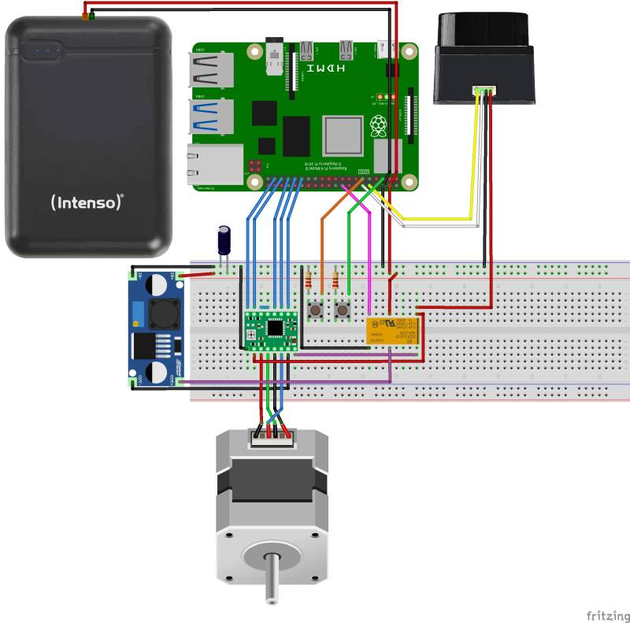
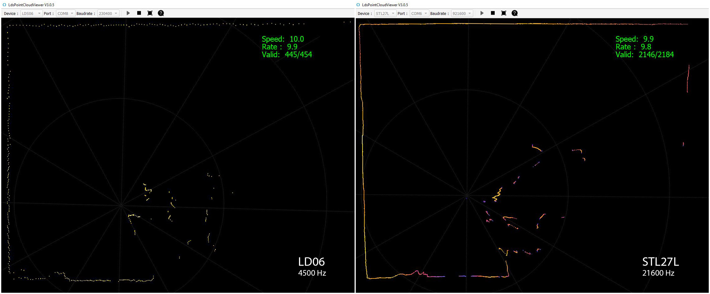

# PiDAR - DIY 360° 3D Panorama Scanner
## WORK IN PROGRESS!

### Core Features:
- **LiDAR**: custom serial driver for LDRobot **LD06**, **LD19** or **STL27L**
    - CRC package integrity check
    - PID-tuned PWM closed-loop control of rotational speed on Raspberry Pi
    - 2D live visualization and export (numpy or CSV)

- **Panorama**: 6K 360° spherical map
    - stitched from fisheye photos using [**Hugin** Panorama photo stitcher](https://hugin.sourceforge.io/)
    - constant camera exposure by reading EXIF data of automatic
    - constant white balance by iterative optimization of color gains

- **3D Scene**: assembly of 3D scenes from 2D planes based on angle and offsets
    - sampling **vertex colors from panorama**
    - Open3D visualization and export (PCD, PLY or [e57](https://github.com/davidcaron/pye57))
    - aligning multiple scenes using **global registration** and **ICP fine-tuning**
    - **Poisson Surface Meshing** (very slow on Pi4, recommended to run on PC)

### Hardware Specs:

- LDRobot LD06, LD19 or STL27L LiDAR
- Raspberry Pi HQ Camera with ArduCam M12 Lens [(M25156H18, p.7)](https://www.arducam.com/doc/Arducam_M12_Lens_Kit_for_Pi_HQ_Camera.pdf)
- Raspberry Pi 4
- NEMA17 42-23 stepper with A4988 driver

- Power Supply: 
    - v1: 2x _18650_ Batteries (7.2V) with step-down converter
    - v2: 10.000 mAh USB Powerbank with step-up converter

- 3D printed: 
    - custom housing with tripod mount ([v1 here](mechanical_design/v1))
    - M12 to C-Mount lens adapter ([thingiverse.com](https://www.thingiverse.com/thing:4444398))
    - NEMA17 planetary reduction gearbox ([printables.com](https://www.printables.com/de/model/782336-nema17-planetary-gearbox-fixed))

Version 1 (using 2x 18650 Batteries):

## wiring

Version 2 - (37Wh Powerbank with Step-Up converter + Relay for power efficiency)

### LD06 / STL27L:
- UART Tx (yellow)
- PWM (white)
- GND (black)
- VCC 5V (red)

### Raspberry Pi:
- LD06 UART0 Rx: GP15
- LD06 PWM0: GP18
- Power Button: GP03
- Scan Button: GP17
- A4988 direction: GP26, step: GP19
- A4988 microstepping mode: GP5, GP6, GP13

### Power Button 
- Wakeup is hardwired to Pin 3
- install [Shutdown script](https://github.com/Howchoo/pi-power-button)

### Power LED and CPU fan
    sudo nano /boot/firmware/config.txt

    # CPU fan at lower temp
    dtoverlay=gpio-fan,gpiopin=4,temp=45000

    # Power LED Heartbeat:
    dtparam=pwr_led_trigger=timer

### Scan Button: register GPIO interrupt

create new service for autostart

    sudo nano /etc/systemd/system/pidar.service

content:

    [Unit]
    Description=GPIO interrupt for PiDAR Scan Button
    After=network.target

    [Service]
    Type=simple
    ExecStart=/usr/bin/python3 /home/pi/Documents/PiDAR/gpio_interrupt.py
    Restart=always
    RestartSec=2

    [Install]
    WantedBy=multi-user.target

reload daemon, enable and start service:

    sudo systemctl daemon-reload
    sudo systemctl enable pidar.service
    sudo systemctl start pidar.service

check service if necessary:

    sudo systemctl status pidar.service

## Serial Protocol
### LD06
baudrate 230400, data bits 8, no parity, 1 stopbit  
sampling frequency 4500 Hz, scan frequency 5-13 Hz, distance 2cm - 12 meter, ambient light 30 kLux

total package size: 48 Byte, big endian.
- starting character：Length 1 Byte, fixed value 0x54, means the beginning of data packet;
- Data Length: Length 1 Byte, the first three digits reserved, the last five digits represent the number of measured points in a packet, currently fixed value 12;
- speed：Length 2 Byte, in degrees per second;
- Start angle: Length: 2 Byte; unit: 0.01 degree;
- Data: Length 36 Byte; containing 12 data points with 3 Byte each: 2 Byte distance (unit: 1 mm), 1 Byte luminance. For white objects within 6m, the typical luminance is around 200.
- End Angle: Length: 2 Byte; unit: 0.01 degree；
- Timestamp: Length 2 Bytes in ms, recount if reaching to MAX 30000；
- CRC check: Length 1 Byte

The Angle value of each data point is obtained by linear interpolation of the starting angle and the ending angle.  
The calculation method of the angle is as following:

    step = (end_angle – start_angle)/(len – 1)  
    angle = start_angle + step*i  

len is the length of the packet, and the i value range is [0, len].

## set Permission for UART on Raspberry Pi
temporary solution: 

    sudo chmod a+rw /dev/ttyS0

### old solution: make it permanent by disabling password for chmod:  

    sudo visudo
    pi ALL=(ALL:ALL) NOPASSWD: /usr/bin/chmod a+rw /dev/ttyS0

then execute the _temporary_ solution from python:

    import subprocess
    command = "sudo chmod a+rw /dev/ttyS0"
    process = subprocess.Popen(command.split(), stdout=subprocess.PIPE)
    output, error = process.communicate()

### new solution: grant permissions to the serial port using udev rules 

(TODO: check and remove old!)
- forget about `visudo` and the subprocess call above.
- Open a terminal and run the following command: `sudo nano /etc/udev/rules.d/50-ttyS0.rules`
- Write the following line in the file and save it: `KERNEL=="ttyS0",GROUP="dialout",MODE="0660"`
- Run the following command to check if your user is a member of the dialout group: `groups`
- If you see `dialout` in the output, you are already a member of the group. If not, run the following command to add your user to the group: `sudo usermod -a -G dialout pi`
- Run the following command to reload the udev rules: `sudo udevadm control --reload-rules`
- Unplug and replug the serial device, or reboot the system, to apply the changes.

## Hardware PWM on Raspberry Pi
enable GPIO_18 (PWM0) and GPIO_19 (PWM1)
    
    echo "dtoverlay=pwm-2chan" >> /boot/config.txt 

check if "pwm_bcm2835" now exists:

    lsmod | grep pwm

Install [RPi Hardware PWM library](https://github.com/Pioreactor/rpi_hardware_pwm):

    pip install rpi-hardware-pwm

## Panorama Stitching
install Hugin with enblend plugin

    sudo apt-get install hugin-tools enblend

## LDRobot LiDAR Specs

LD06: 
- sampling frequency: 4500 Hz
- baudrate 230400
- [Sales page](https://www.inno-maker.com/product/lidar-ld06/)
- [mechanical Datasheet](https://www.inno-maker.com/wp-content/uploads/2020/11/LDROBOT_LD06_Datasheet.pdf)
- [Protocol Description](https://storage.googleapis.com/mauser-public-images/prod_description_document/2021/315/8fcea7f5d479f4f4b71316d80b77ff45_096-6212_a.pdf)

STL27L:
- sampling frequency: 21600 Hz
- baudrate 921600
- [datasheet](https://github.com/May-DFRobot/DFRobot/blob/master/SEN0589_Datasheet.pdf)
- [wiki](https://www.waveshare.com/wiki/DTOF_LIDAR_STL27L)
- ROS2 driver [git](https://github.com/ldrobotSensorTeam/ldlidar_stl_ros2?tab=readme-ov-file#Instructions)

## Troubleshooting

### poor performance of VS Code on Raspberry Pi
disable hardware acceleration for VS Code ([source](https://code.visualstudio.com/docs/setup/raspberry-pi))

    Preferences: Configure Runtime Arguments  
    Set "disable-hardware-acceleration": true

### pye57 on Raspberry Pi
there is no wheel for arm64. build requires libxerces:

    sudo apt install libxerces-c-dev
    pip install pye57

## links and references:

inspirations
- [LIDAR_LD06_python_loder](https://github.com/henjin0/LIDAR_LD06_python_loder) and [Lidar_LD06_for_Arduino](https://github.com/henjin0/Lidar_LD06_for_Arduino) by Inoue Minoru ("[henjin0](https://github.com/henjin0)")
- [ShaunPrice's](https://github.com/ShaunPrice/360-camera) StereoPi-supporting fork of [BrianBock's](https://github.com/BrianBock/360-camera) 360-camera script
- StereoPi Article on [Medium](https://medium.com/stereopi/stitching-360-panorama-with-raspberry-pi-cm3-stereopi-and-two-fisheye-cameras-step-by-step-guide-aeca3ff35871)

another Lidar implementation in Python
- [pyLIDAR](https://github.com/Paradoxdruid/pyLIDAR)

ICP implementations:
- Aeva [Doppler-ICP](https://github.com/aevainc/Doppler-ICP/blob/main/README.md)
- Photogrammetry & Robotics Bonn [KISS-ICP](https://github.com/PRBonn/kiss-icp) and [Lidar-Visualizer](https://github.com/PRBonn/lidar-visualizer)

PID tuning basics:
- [An Introduction to Proportional-Integral-Derivative (PID) Controllers](https://engineering.purdue.edu/~zak/ECE_382-Fall_2018/IntroPID_16.pdf)
- [PID Tuning via Classical Methods - Engineering LibreTexts](https://eng.libretexts.org/Bookshelves/Industrial_and_Systems_Engineering/Chemical_Process_Dynamics_and_Controls_%28Woolf%29/09%3A_Proportional-Integral-Derivative_%28PID%29_Control/9.03%3A_PID_Tuning_via_Classical_Methods)
- [PID Tuning | How to Tune a PID Controller - RealPars](https://www.realpars.com/blog/pid-tuning)
- [PLC PID Control Tuning: Practical Tips and Methods](https://controlforge.github.io/posts/PLC-PID-Control-Tuning-Practical-Tips-and-Methods/)

PID advanced: Anti-Windup
- [Anti-Windup Control Using PID Controller Block - MathWorks](https://www.mathworks.com/help/simulink/slref/anti-windup-control-using-a-pid-controller.html)
- [Design and Modeling of Anti Wind Up PID Controllers](https://link.springer.com/chapter/10.1007/978-3-319-12883-2_1)
- [PID Anti-windup Techniques - Erdos Miller](https://info.erdosmiller.com/blog/pid-anti-windup-techniques)
- [Comparative Study of Anti-windup Techniques on Performance ... - Springer](https://link.springer.com/chapter/10.1007/978-981-15-4676-1_10)

3D Demo Data for global registration, ICP, meshing etc.:
- [BunnyMesh.ply](https://github.com/isl-org/open3d_downloads/releases/download/20220201-data/BunnyMesh.ply) from [20220201-data](https://github.com/isl-org/open3d_downloads/releases/tag/20220201-data)
- [DemoICPPointClouds.zip](https://github.com/isl-org/open3d_downloads/releases/download/20220301-data/DemoICPPointClouds.zip) from [20220301-data](https://github.com/isl-org/open3d_downloads/releases/tag/20220301-data)
